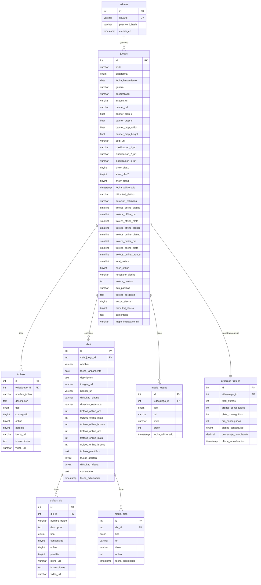

# Diagrama Entidad-Relación (ER) - Base de Datos Videojuegos

Este diagrama muestra la estructura relacional de la base de datos de la aplicación de gestión de trofeos PS4/PS5.

## Descripción de las Relaciones

### admins → juegos
- **Relación**: Uno a muchos (1:N)
- **Descripción**: Un administrador puede gestionar múltiples videojuegos
- **Cardinalidad**: Un admin puede tener 0 o muchos juegos

### juegos → trofeos
- **Relación**: Uno a muchos (1:N)
- **Descripción**: Un videojuego puede tener múltiples trofeos
- **Cardinalidad**: Un juego tiene 0 o muchos trofeos
- **Cascade**: Al eliminar un juego, se eliminan sus trofeos

### juegos → dlcs
- **Relación**: Uno a muchos (1:N)
- **Descripción**: Un videojuego puede tener múltiples DLCs
- **Cardinalidad**: Un juego tiene 0 o muchos DLCs
- **Cascade**: Al eliminar un juego, se eliminan sus DLCs

### juegos → media_juegos
- **Relación**: Uno a muchos (1:N)
- **Descripción**: Un videojuego puede tener múltiples elementos multimedia
- **Cardinalidad**: Un juego tiene 0 o muchos elementos multimedia
- **Cascade**: Al eliminar un juego, se elimina su multimedia

### juegos → progreso_trofeos
- **Relación**: Uno a uno (1:1)
- **Descripción**: Cada videojuego tiene un registro único de progreso
- **Cardinalidad**: Un juego tiene exactamente un registro de progreso
- **Unique**: videojuego_id es único en progreso_trofeos

### dlcs → trofeos_dlc
- **Relación**: Uno a muchos (1:N)
- **Descripción**: Un DLC puede tener múltiples trofeos
- **Cardinalidad**: Un DLC tiene 0 o muchos trofeos
- **Cascade**: Al eliminar un DLC, se eliminan sus trofeos

### dlcs → media_dlcs
- **Relación**: Uno a muchos (1:N)
- **Descripción**: Un DLC puede tener múltiples elementos multimedia
- **Cardinalidad**: Un DLC tiene 0 o muchos elementos multimedia
- **Cascade**: Al eliminar un DLC, se elimina su multimedia

## Tipos de Datos Utilizados

- **INT**: Enteros para IDs y contadores
- **VARCHAR**: Cadenas de texto de longitud variable
- **TEXT**: Texto largo para descripciones y comentarios
- **ENUM**: Valores predefinidos (plataforma, tipo de trofeo, tipo de media)
- **DATE**: Fechas (lanzamiento)
- **TIMESTAMP**: Fechas y horas automáticas
- **TINYINT**: Valores booleanos (0/1)
- **SMALLINT**: Números pequeños (contadores de trofeos)
- **FLOAT**: Números decimales (coordenadas de crop)
- **DECIMAL**: Números decimales precisos (porcentajes)

## Índices y Restricciones

### Índices
- **idx_titulo**: Índice en juegos.titulo para búsquedas
- **idx_plataforma**: Índice en juegos.plataforma para filtrado
- **idx_fecha**: Índice en juegos.fecha_lanzamiento
- **idx_videojuego_id**: Índices en tablas hijas para joins
- **idx_orden**: Índices en tablas de media para ordenamiento

### Foreign Keys
- Todas las relaciones tienen foreign keys con CASCADE DELETE
- Garantiza integridad referencial
- Eliminación en cascada automática

### Unique Keys
- admins.usuario: Nombre de usuario único
- progreso_trofeos.videojuego_id: Progreso único por juego

## Cómo usar este diagrama

1. Copia el código Mermaid del bloque de código
2. Visita https://www.mermaideditor.io/diagrams/er
3. Pega el código en el editor
4. El diagrama se generará automáticamente
5. Puedes exportarlo como PNG, SVG o PDF
