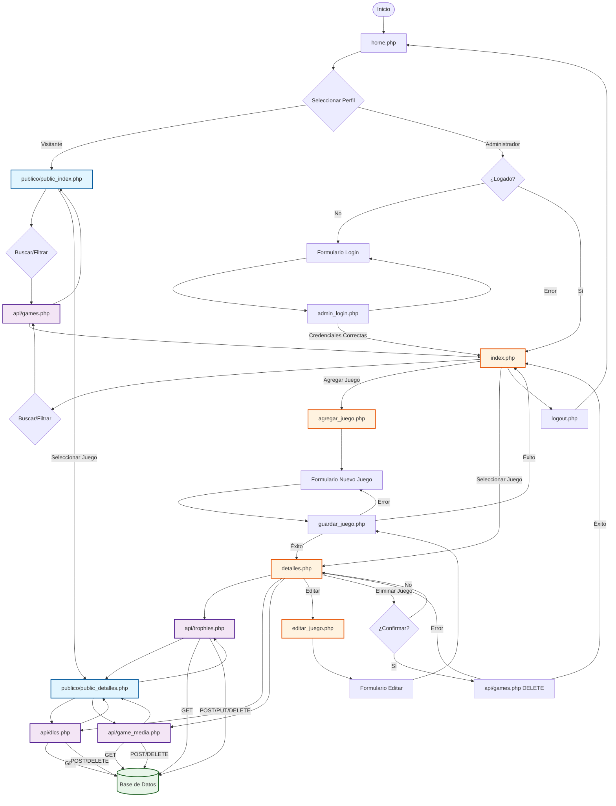

# Diagrama de Flujo de la Aplicación - Gestión de Trofeos PS4/PS5

Este diagrama muestra el flujo completo de la aplicación, desde el acceso hasta la gestión de videojuegos y trofeos.

## Descripción del Flujo

### 1. Página de Inicio (home.php)
- Usuario accede a la aplicación
- Puede seleccionar entre perfil "Visitante" o "Administrador"
- Si selecciona Administrador, debe autenticarse

### 2. Autenticación (admin_login.php)
- Validación de credenciales con bcrypt
- Protección CSRF
- Redirección al panel de administración si es exitoso

### 3. Vista Pública (publico/public_index.php)
- Catálogo de videojuegos sin autenticación
- Búsqueda y filtrado por plataforma
- Visualización de detalles de juegos
- Solo lectura, sin capacidad de edición

### 4. Panel de Administración (index.php)
- Requiere autenticación
- Lista completa de videojuegos
- Búsqueda y filtrado avanzado
- Opciones para agregar, editar y eliminar juegos

### 5. Gestión de Videojuegos
- **Agregar** (agregar_juego.php): Formulario para crear nuevos juegos
- **Editar** (editar_juego.php): Formulario para modificar juegos existentes
- **Eliminar** (editar_juego.php): Botón para eliminar juego completo
  - Doble confirmación para evitar eliminaciones accidentales
  - Llamada a API DELETE en cascada
- **Guardar** (guardar_juego.php): Procesa y guarda los datos en la base de datos

### 6. API Endpoints
- `api/games.php`: CRUD de juegos
- `api/trophies.php`: CRUD de logros/trofeos
- `api/dlcs.php`: CRUD de DLCs
- `api/game_media.php`: Gestión de multimedia

### 7. Seguridad
- Todos los endpoints usan prepared statements
- Protección CSRF en formularios
- Validación de archivos en uploads
- Headers de seguridad HTTP
- CORS restringido

## Componentes Principales

### Frontend
- **Páginas PHP**: home.php, index.php, detalles.php, editar_juego.php, agregar_juego.php
- **Vistas Públicas**: publico/public_index.php, publico/public_detalles.php
- **JavaScript**: index.js, detalles_public.js, editar_juego.js, agregar_juego.js
- **CSS**: Estilos personalizados para cada vista

### Backend
- **Configuración**: config.php (conexión BD, headers de seguridad)
- **Autenticación**: auth.php, csrf.php
- **API**: api/game.php, api/trophies.php, api/dlcs.php, api/dlc_trophies.php, api/game_media.php
- **Procesamiento**: guardar_juego.php, admin_login.php, logout.php

### Base de Datos
- MySQL/MariaDB con charset UTF-8
- Tablas relacionadas con foreign keys
- Índices optimizados para búsquedas
